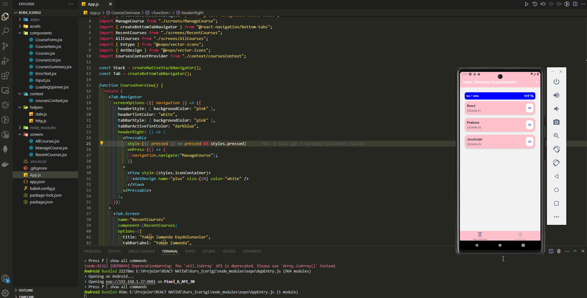
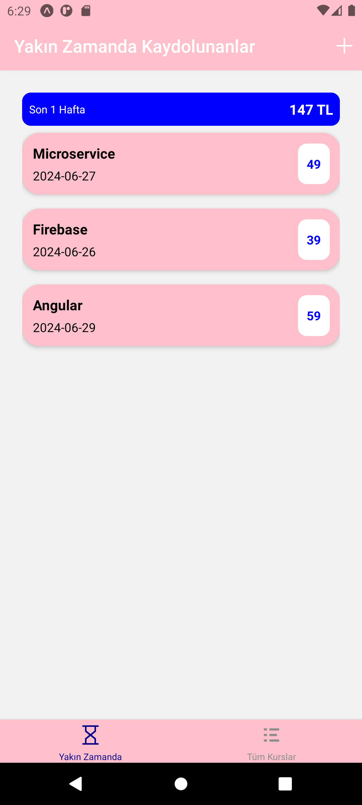
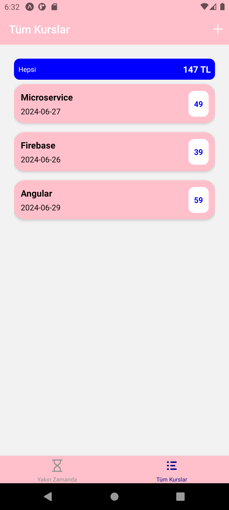
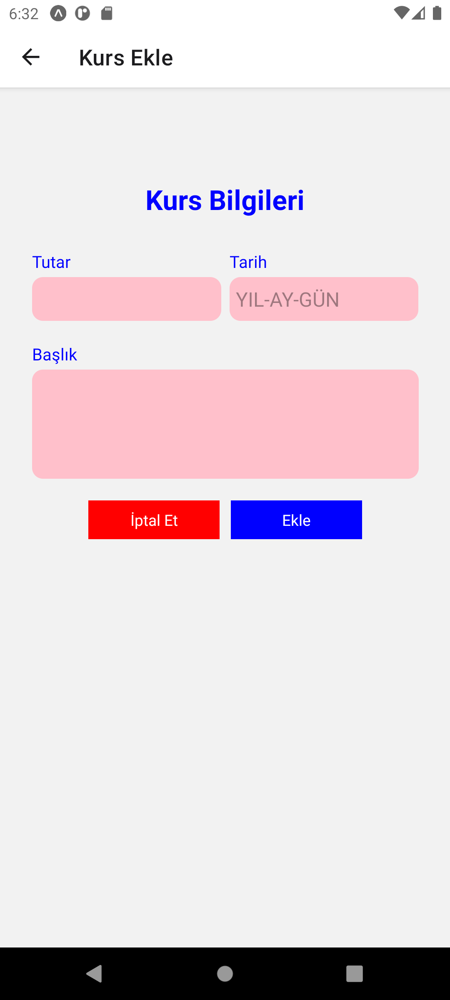

# Course Content Management App

<div align="center">
  
</div>

## About the Project

This project is a React Native application that allows users to manage course content. Users can add new courses, edit existing courses, and delete courses.

## Table of Contents

- [Features](#features)
- [Technologies Used](#technologies-used)
- [Project Skeleton](#project-skeleton)
- [Screenshots](#screenshots)

## Features

- **Add Course:** Add new courses and input their details.
- **Edit Course:** Update existing courses.
- **Delete Course:** Remove courses.
- **List Courses:** Display recently enrolled and all courses.
- **Filter Courses:** Filter courses enrolled recently.
- **Total Amount:** Display the total amount of courses.

## Technologies Used

<ul>
    <li><b>React Native:</b> For mobile application development.</li>
    <li><b>Expo:</b> Development platform for React Native.</li>
    <li><b>React Navigation:</b> For navigation within the app.
        <ul>
            <li>@react-navigation/native</li>
            <li>@react-navigation/bottom-tabs</li>
            <li>@react-navigation/native-stack</li>
        </ul>
    </li>
    <li><b>Axios:</b> For managing HTTP requests.</li>
    <li><b>Firebase Realtime Database:</b> For data storage and management.</li>
    <li><b>React Context API:</b> For global state management.</li>
</ul>

## Project Skeleton

```
Course Content Management App (folder)
│
├── assets
│     └── [images]
├── components
│     ├── AuthContent.jsx 
│     ├── AuthForm.jsx 
│     ├── Button.jsx 
│     ├── ButtonWhite.jsx 
│     ├── Input.jsx       
│     └── Loading.jsx 
├── context      
│     └── AuthContext.jsx 
├── helpers      
│     └── auth.js
├── screens
│     ├── HomeScreen.jsx 
│     ├── LoginScreen.jsx      
│     └── SignUpScreen.jsx 
├── .gitignore
├── App.js
├── app.json
├── babel.config.js
├── package-lock.json
├── package.json
└── README.md
```

## Screenshots

<div align="center">
  
  
  
</div>